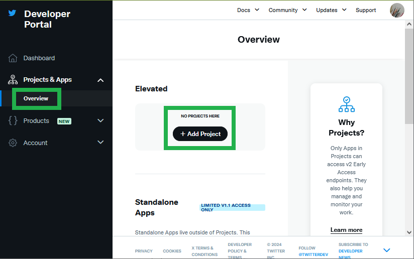
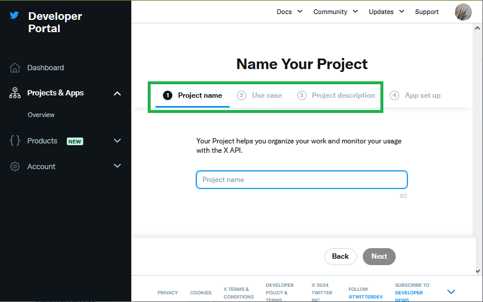
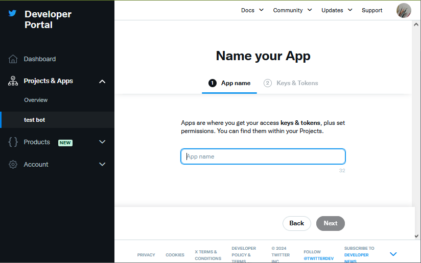
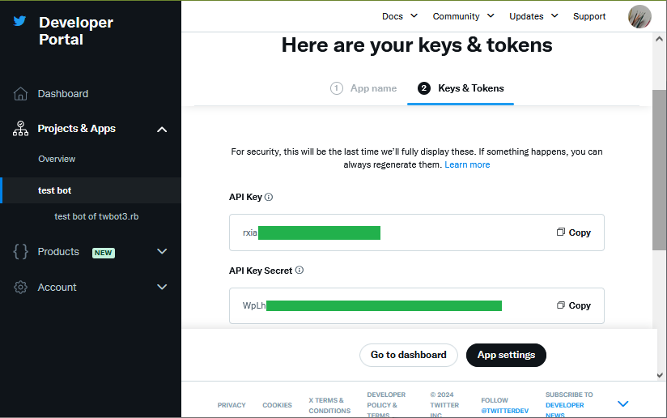
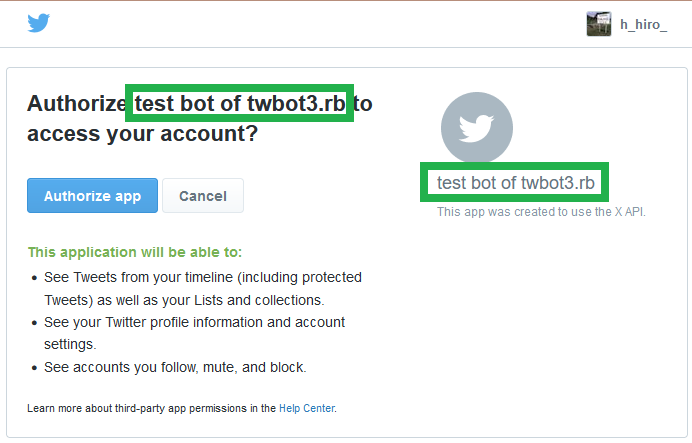
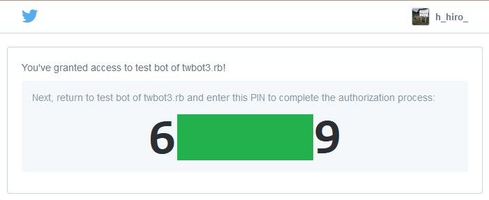

# twbot3.rb: Instructions to preparing environments

**Notice: "Twitter" was renamed to "X", but in this document it is called "Twitter" for higher identifiability.**

# Installation

First you need to [Ruby OAuth library](https://gitlab.com/oauth-xx/oauth/). It can be installed via rubygems:

    gem install oauth

Then, download `twbot3.rb` and put it in the same directory as the bot program's location.

# Registration of your app

You need to register your app in [Twitter developer portal](https://developer.twitter.com/en/portal/dashboard). If you already did this, skip these processes.

Each Twitter app must belong to a "project". So, if you have not create any project, you need to create it.  
If you have already created a project, skip the process. (Notice that only one app can be created if you use APIs with free plan.)  

Input information of the project.  

Then you will move to register the app under the project.  

Finally you will receive the API key and the API key secret, which identifies the app. **Notice that, as noted in the page, the key and the secret are displayed only here; you must keep it in your storage.** (If you lose them, the key and the secret can be regenerated, but old ones become invalid. Old key and secret in existing programs must be updated.)  

# Running a bot program

For examples of bot programs, see the files `twbot3-sample-post.rb` and `twbot3-sample-apiaccess.rb`. The example of `twbot3-sample-post.rb` is used here.

We have only to define messages posted by the bot as the following format:

    $ cat twbot3-sample-post.rb
    
    #!/usr/bin/env ruby
    # -*- coding: utf-8 -*-
    
    require "./twbot3"
    TwBot.create("config-post.yml", "error-post.log").cui_menu do
      ['Test message!']
    end

## 1. Set API key and secret

First you need to set the API key and the API key secret of the app (see above). This can be done by the command `ruby twbot3-sample-post.rb consumer=[KEY],[SECRET]`.

    $ ruby twbot3-sample-post.rb consumer=rxiaXXXXXXXXXXXX,WpLhXXXXXXXXXXXX
    
    Running mode 'consumer=rxiaXXXXXXXXXXXX,WpLhXXXXXXXXXXXX'...
    [2024-02-12 00:00:00 +0000](mode=consumer=rxiaXXXXXXXXXXXX,WpLhXXXXXXXXXXXX)
    [cui_menu:mode=consumer=rxiaXXXXXXXXXXXX,WpLhXXXXXXXXXXXX]

## 2. Authenticate a user

Then you need to authenticate the user to post messages. This can be done by the command `ruby twbot3-sample-post.rb add=[USERNAME]`.

    $ ruby twbot3-sample-post.rb add=h_hiro_

    Running mode 'add=h_hiro_'...
    ============================================================
    To retrieve OAuth token of user "h_hiro_":
    (1) Log in Twitter with a browser for user "h_hiro_".
    (2) Access the URL below with same browser:
        https://api.twitter.com/oauth/authenticate?oauth_token=XXXXXXXXXXXX
    (3) Check the application name is the one you registered,
        and if so, click "Allow" link in the browser.
    (4) Input the shown number (PIN number).
        To cancel, input nothing and press enter key.
    ============================================================
    PIN number >

Following the instruction, access the URL **with a browser logged in as the user**.  
Confirm the app name and, if alright, select "Authorize app".  

Then you will receive 7-digit pin number.  

So, in the prompt "PIN number", input the number. Then, the message "successfully registered" will appear if succeeded.

    PIN number > 6XXXXX9
    User "h_hiro_" is successfully registered.
    Default user is set to @h_hiro_.
    [2024-02-12 00:01:00 +0000](mode=add=h_hiro_)
    [cui_menu:mode=add=h_hiro_]

## 3. Prepare a message

Running the command `ruby twbot3-sample-post.rb load` prepares messages to be posted, according to the program you wrote.

    $ ruby twbot3-sample-post.rb load
    
    Running mode 'load'...
    [2024-02-12 00:02:00 +0000](mode=load)
    [cui_menu:mode=load]

## 4. Post a message

Running the command `ruby twbot3-sample-post.rb post` posts a message prepared previously.

    $ ruby twbot3-sample-post.rb post

    Running mode 'post'...
    [Updated!] {"data":{"edit_history_tweet_ids":["1234XXXXXXXXXXXX"],"id":"1234XXXXXXXXXXXX","text":"Test message!"}}
    [2024-02-12 00:03:00 +0000](mode=post)
    [cui_menu:mode=post](A tweet has been posted)

# Programming your bot

To find functionalities provided by twbot3.rb, please see the document at `doc` directory.

# Copyrights

The original author, H.Hiro(Maraigue), distributes the library under "new BSD License". You may re-distribute a modified library as long as the original version's license text is included (details are shown in LICENSE.txt).

# Contact

Original author: H.Hiro(Maraigue) (e-mail: main at hhiro.net, website: http://hhiro.net/)

To request new features and/or bug fixes, contact the e-mail address or send a pull request via GitHub (https://github.com/maraigue/twbot3.rb/).
